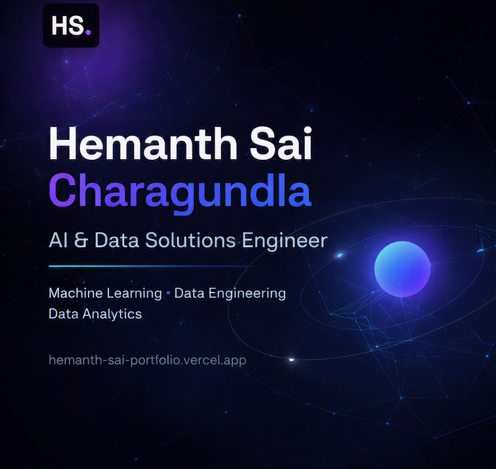

# Hemanth Sai Charagundla — AI & Data Portfolio

  

  <strong>AI & Data Solutions Engineer</strong> 
  Data Engineering · Machine Learning · Data Analytics · Full-Stack Development

  <a href="https://hemanth-sai-portfolio.vercel.app/"><strong>Live Portfolio</strong></a>
  &nbsp;•&nbsp;
  <a href="https://github.com/Hemanthsai456">GitHub</a>
  &nbsp;•&nbsp;
  <a href="https://www.linkedin.com/in/hemanthsai456">LinkedIn</a>
  &nbsp;•&nbsp;
  <a href="https://leetcode.com/u/Hemanthsai456/">LeetCode</a>

---

## About

I'm **Hemanth Sai Charagundla**, an Artificial Intelligence & Data Science student at **Chaitanya Bharathi Institute of Technology (CBIT), Hyderabad**.

I build practical, end-to-end systems across **data engineering, machine learning, analytics, and full-stack development** — with a focus on turning real-world data and problems into usable technical solutions.

My work ranges from multi-year healthcare data warehouses and ML decision-support systems to recommendation engines and full-stack applications.

**Currently open to internship opportunities.**

---

## Selected Work

### Healthcare Analytics & Business Intelligence System

Production-style healthcare analytics platform built around a **PostgreSQL dimensional data warehouse**, integrating **16.3M+ records across seven years** for clinical, operational, financial, and geographic analysis.

The system combines ETL pipelines, dimensional modeling, optimized analytical layers, materialized views, and Power BI reporting to transform large-scale transactional healthcare data into decision-ready intelligence.

`PostgreSQL` `SQL` `ETL` `Dimensional Modeling` `Power BI`

[**View Repository →**](https://github.com/Hemanthsai456/sparcs-healthcare-analytics-bi)

---

### Medical Inventory Forecasting & Decision Support System

End-to-end machine learning system designed to support medical inventory planning through demand forecasting and interpretable recommendations.

The project evaluates **14 machine learning models**, with Gradient Boosting achieving **R² = 0.7988**, and extends prediction with **SHAP explainability**, K-Means demand segmentation, error analysis, and an interactive Streamlit application.

`Python` `Scikit-Learn` `SHAP` `K-Means` `Pandas` `Streamlit`

[**View Repository →**](https://github.com/Hemanthsai456/Medical-Inventory-Forecasting-Decision-Support-System)
&nbsp;•&nbsp;
[**Live Application →**](https://hemanthsai-medical-inventory-decision-support.streamlit.app/)

---

### NIDHI — AI Investor Super App

Full-stack investment platform designed to bring portfolio management, financial analytics, risk intelligence, education, and AI-assisted investment guidance into a unified application.

Built with a modern Next.js architecture and interactive financial workflows aimed at making portfolio insights and investment information easier to understand and act on.

`Next.js` `React` `TypeScript` `AI Recommendations`

[**View Repository →**](https://github.com/Hemanthsai456/NIDHI)
&nbsp;•&nbsp;
[**Live Application →**](https://nidhiapp.vercel.app)

---

## What You'll Find in the Portfolio

The portfolio brings together my strongest work across:

- **Data Engineering** — relational modeling, ETL pipelines, dimensional warehouses, query optimization, and analytical data layers
- **Machine Learning** — predictive modeling, model evaluation, explainability, clustering, NLP, and recommendation systems
- **Data Analytics** — SQL analytics, exploratory analysis, Power BI, Tableau, and interactive dashboards
- **Full-Stack Development** — React, Next.js, TypeScript, Node.js, APIs, and real-time web applications

Each featured project links to its dedicated repository or deployed application for deeper technical details.

---

## Built With

`HTML5` `CSS3` `JavaScript` `tsParticles` `Lucide` `Font Awesome`

The portfolio is a responsive single-page website built without a frontend framework, with custom styling and interactions including:

- Responsive desktop, tablet, and mobile layouts
- Smooth section navigation and active navigation tracking
- Scroll-based reveal animations
- Interactive project and skill cards
- Dynamic typing and ambient particle effects
- Accessible navigation and focus states
- Open Graph, structured metadata, sitemap, and search-engine metadata

Deployed on **Vercel**.

---

## Explore

The website is the primary way to explore my work, projects, technical background, experience, and professional profiles.

### [Visit hemanth-sai-portfolio.vercel.app →](https://hemanth-sai-portfolio.vercel.app/)

---

## Connect

**Hemanth Sai Charagundla**  
Hyderabad, India

[LinkedIn](https://www.linkedin.com/in/hemanthsai456) ·
[GitHub](https://github.com/Hemanthsai456) ·
[LeetCode](https://leetcode.com/u/Hemanthsai456/)

---

## License

This repository is licensed under the [MIT License](LICENSE).

---

  Designed and built by Hemanth Sai Charagundla.

